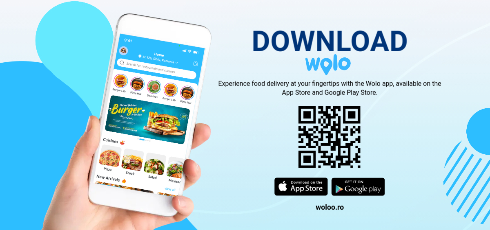
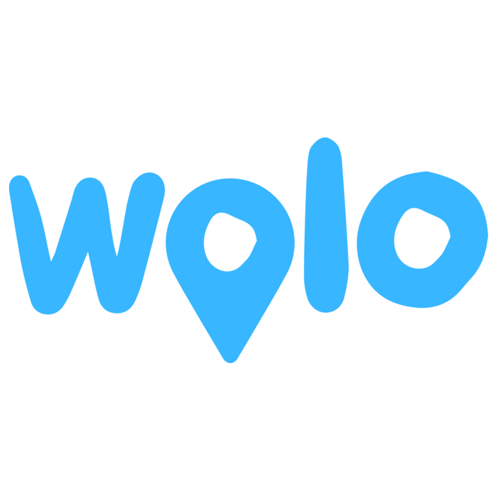
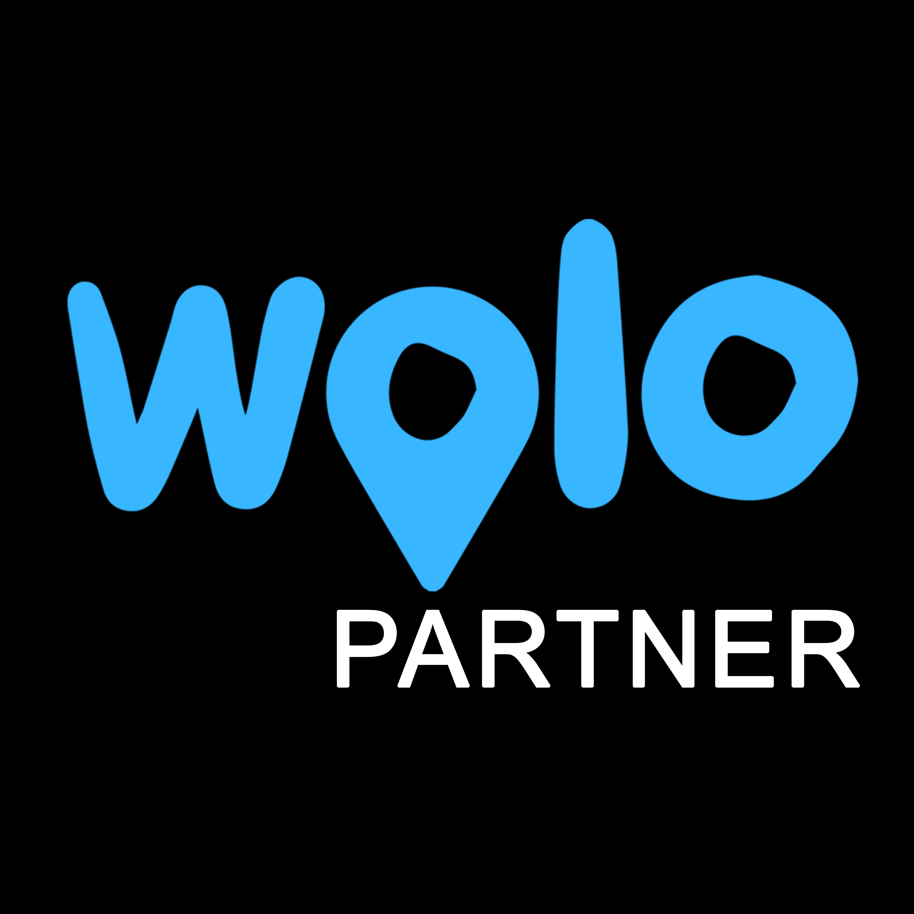
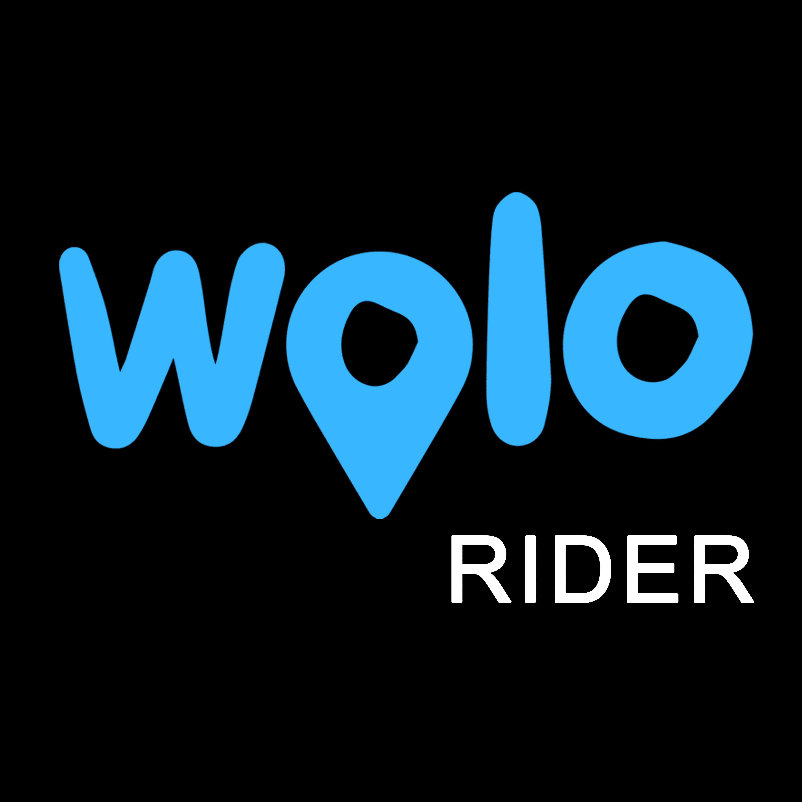

  
  
  

 
# 🍴 Welcome to Wolo – Delivering Happiness, One Meal at a Time! 🚴‍♂️  

At **Wolo**, we’re redefining food delivery in Romania by connecting customers, restaurants, and couriers in a way that values quality, fairness, and reliability. Whether it’s your favorite comfort food or a quick lunch on a busy day, Wolo ensures it gets to you fresh and fast!  

---

## 🎯 **Our Mission**  
Our mission is clear: To deliver happiness, one meal at a time.
We empower local restaurants to grow, create meaningful earning opportunities for couriers, and provide customers with exceptional service every step of the way.

## 🌟 **Our Vision**  
We aim to become Romania’s most trusted and preferred food delivery platform, fostering value for our partners and delighting customers with every order. 

---

## 🚀 **Why Choose Wolo?**  

- 🏷️ **Fair Commission Structure**  
  Supporting local restaurants with transparent and equitable terms.  

- 🚲 **Empowering Couriers**  
  Providing meaningful earning opportunities for our delivery heroes.  

- 🤝 **Transparent Policies**  
  Building trust through clarity for all users.  

- 💡 **Cutting-Edge Technology**  
  Using advanced tools to ensure seamless and efficient deliveries.  

- ⏱️ **Fast & Reliable Delivery**  
  Ensuring your meals arrive fresh and on time.  

- ❤️ **Customer-Centric Experience**  
  Prioritizing exceptional service at every step of your journey.  

---

## 🌍 **Meet Our Team**  

- **Founder / CEO**: Shadeez Madushan 🇱🇰  
- **Head of Partnerships**: Razvan Grec 🇷🇴  
- **Chief Technology Officer**: Kosala Indrasiri 🇱🇰  
- **UI/UX Designer**: Laiba Dawood 🇵🇰  

---

## 📲 **Join the Wolo Ecosystem**  

Experience the future of food delivery with Wolo! Whether you’re a customer, a restaurant partner, or a delivery rider, we have the perfect solution for you.  

### 📱 **Mobile Apps**  

- **Wolo App**: For users and customers to browse, order, and track their favorite meals.  
- **Wolo Partner App**: Designed for restaurant partners to manage orders and connect with customers.  
- **Wolo Rider App**: Empowering delivery riders to efficiently manage their tasks and maximize earnings.  

### 💻 **Web Apps**  

- **Wolo Web**: An intuitive platform for users and customers to explore menus and place orders seamlessly.  
- **Wolo Partner Web**: A powerful tool for restaurant partners to handle orders and analytics, all from their desktop.  

---

💡 **Get Started Today!**  
Choose your role and access the tools you need to thrive:  

- **Download our apps**: [App Store](#) | [Google Play](#)  
- **Visit our web apps**: [Wolo Web](https://food.woloo.ro/) | [Wolo Partner Web](https://restaurant.food.woloo.ro/)  

---

With Wolo, everyone wins. Join us and make food delivery better for all! 🍔🚀  

---

## 📫 **Get in Touch**  

- **Address:** Str. Malinului Nr.33, Sibiu, Romania  
- **Email:** [contact@woloo.ro](mailto:contact@woloo.ro)  
- **Phone:** +40 790 254 723  

---

**With Wolo, your favorite meals are just a tap away. Order now, relax, and let us bring deliciousness to your doorstep!**  

🍔🍕🌮🌱  
